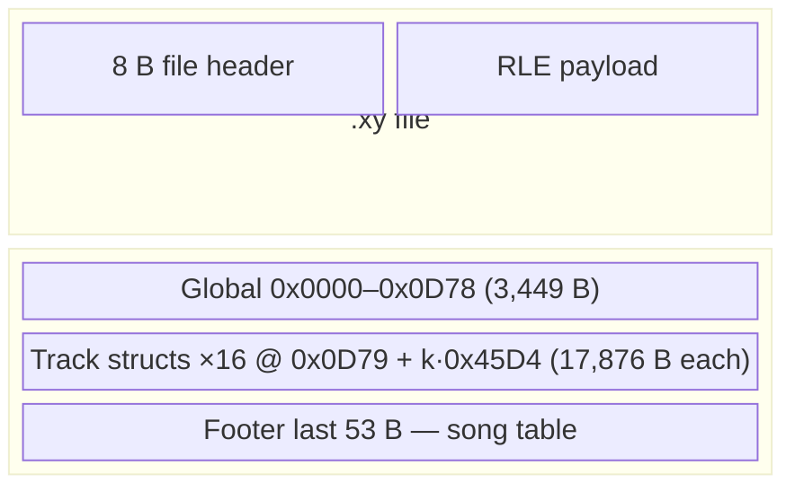

# Decoded Image Coverage Map

> **Purpose:** At-a-glance **mapped vs unmapped** regions of the OP-XY decoded
> RAM image (~290 KB). Use this for oversight, probe planning, and speculation.
>
> **Companion docs** (detail, not duplication):
> - Field pins & evidence: [`decoded_image_map.md`](decoded_image_map.md)
> - Read/write/API status: [`parse_capability_checklist.md`](../parse_capability_checklist.md)
> - Guide feature gaps: [`opxy_user_guide_save_audit.md`](opxy_user_guide_save_audit.md)
> - Probe recipes: `src/*-probes/*/README.md`

**Baseline:** `unnamed 1.xy` · decoded size **289,521** bytes · firmware **1.1.4**
unless noted.

---

## Legend

| Mark | Meaning |
| --- | --- |
| **x** | Field-level decode — stable offset(s), tests or device validation |
| **~** | Region located — partial field map, donor-copy only, or semantics open |
| **ui** | Known to change with UI session — imitate from captures, don't derive |
| **?** | No stable map — good probe target |

**Track-relative** offsets below are `+` from each track struct base.
Track `k` base = `0x0D79 + k × 0x45D4` (`k` = 0…15 → T1…T16).

---

## Top-level layout



```
0x000000  ┌─────────────────────────────────────┐
          │ GLOBAL HEADER          3,449 bytes  │
0x000D79  ├─────────────────────────────────────┤
          │ TRACK 1 (T1)          17,876 bytes  │
0x00524D  ├─────────────────────────────────────┤
          │ TRACK 2 … TRACK 16                  │
          ├─────────────────────────────────────┤
          │ FOOTER (song table)      56 bytes  │
0x046AF0  └─────────────────────────────────────┘  (= 289,521)
```

`unnamed 1.xy` measured: T1 @ `0x0D79`, stride `0x45D4`, footer **56** B
(`0x46AEC`–`0x46AF0`). Older notes say 53 B — treat footer size as **[~]**.

---

## 1. Global header (`0x0000` – `0x0D78`)

| Range | Size | Status | What we know | Probe / API |
| --- | ---: | --- | --- | --- |
| `0x00`–`0x01` | 2 | **x** | Tempo u16 LE (tenths BPM) | `set_tempo`, P1 corpus |
| `0x02` | 1 | **x** | Groove amount, signed i8 | HDR `hdr-grv-*` |
| `0x03` | 1 | **x** | Groove type enum | `set_groove` |
| `0x04` | 1 | **x** | Metronome click volume; off persists as volume 0 in HDR probes | `set_click_volume`, HDR `hdr-mclk-*` |
| `0x05` | 1 | **?** | Co-changes in some captures; role open | — |
| `0x06` | 1 | **x** | Active scene slot, zero-based | HDR `hdr-arr-act*` |
| `0x07` | 1 | **x** | Active song slot, zero-based when explicit; `0x10` fresh Song 1 sentinel | HDR `hdr-arr-song*` |
| `0x08` | 1 | **x** | Scene length mode | PCFG |
| `0x09`–`0x0E` | 6 | **?** | No pinned guide-visible field yet | — |
| `0x0F`–`0x11` | 3 | **~** | Song/scene UI selection cluster | `record_structure.md` §5 |
| `0x12`–`0x54` | 67 | **?** | Sparse touches in corpus; no field map | inspector sweep |
| `0x55`–`0x64` | 16 | **x** | Per-track MIDI channel (T1…T16) | `set_midi_channel` |
| `0x64`–`0x67` | 4 | **~** | Prefix u32 (default `0xFF`); not saturator | P2-F `eq2` tail spill |
| `0x68`–`0x6B` | 4 | **x** | Master EQ **bass** (level @ `0x68`) | P2-F `eq*` |
| `0x6C`–`0x6F` | 4 | **x** | Master EQ **mid** (level @ `0x6C`) | P2-F |
| `0x70`–`0x73` | 4 | **x** | Master EQ **treble** (level @ `0x70`) | P2-F |
| `0x74`–`0x77` | 4 | **~** | Legacy “blend” u32 (default `0x40`); **4th EQ UI knob does not write here** — acts as EQ **power** over the three band bytes (`eq7` no-op, `eq8` all bands `0x7F` from baseline) | P2-F `eq7`/`eq8` |
| `0x75`–`0x78` | 4 | **x** | Saturator **gain** (level @ `0x78`, `u32+3`) | P2-G `sat*` |
| `0x79`–`0x7C` | 4 | **x** | Saturator **clip** (level @ `0x7C`) | P2-G |
| `0x7D`–`0x80` | 4 | **x** | Saturator **tone** (level @ `0x80`) | P2-G |
| `0x81`–`0x84` | 4 | **x** | Saturator **mix** (level @ `0x84`) | P2-G |
| `0x85`–`0x88` | 4 | **x** | Master percussion vol (byte @ `0x88`) | P2-A `f10`/`f11` |
| `0x89`–`0x8C` | 4 | **x** | Master melody vol (byte @ `0x8C`) | P2-A `f12`/`f13` |
| `0x8D`–`0x90` | 4 | **x** | Master compressor (byte @ `0x90`) | P2-A `f14`/`f15` |
| `0x91`–`0x94` | 4 | **x** | Master output vol (byte @ `0x94`) | P2-D `s5b` |
| `0x95`–`0x0D78` | 3300 | **~** | **Pre-track / scene region** — 33-byte scene slots @ `0x95 + n×33` (`sel[16]+mute[16]+flags`). Fills to track base in max layout; handle table + loader tail semantics in flat image still partial | P2-E mutes; `pretrack_records.py` |

### Scene slot record (33 bytes each @ `0x95 + slot×33`)

| Offset in slot | Size | Status | Field |
| --- | ---: | --- | --- |
| `+0`–`+15` | 16 | **x** | Pattern index per track (0-based) |
| `+16`–`+31` | 16 | **x** | Mute per track (`0` = on, `2` = muted) — P2-E scenes 1–8, slot `N−1` |
| `+32` | 1 | **~** | Flags (`0x01` active row) |

---

## 2. Track struct (17,876 bytes × 16)

Each instrument/aux track repeats this layout. Status applies to **every**
track unless noted.

### 2a. Header & identity

| +Offset | Status | Field | Notes |
| --- | --- | --- | --- |
| `+0x00` | **x** | Pattern count (leader) | Multi-pattern |
| `+0x01` | **x** | Total pattern steps, including final-bar partial length (`(bars-1)*16+last_bar`) | BAR-LEN, `set_pattern_steps` |
| `+0x02`–`+0x03` | **x** | Bar-menu default step length, u16 ticks (`240` default, `480` max) | BAR `bar-l-*` |
| `+0x06` | **x** | Track scale byte | `set_track_scale` |
| `+0x07` | **~** | Bar-menu quantization raw byte; exact UI scaling partial | BAR `bar-q-*` |
| `+0x08` | **x** | Bar-menu per-track groove override index byte into displayed UI sequence | BAR `bar-g*` |
| `+0x03`–`+0x0A` | **~** | Early header bytes; no longer a stable signature because BAR fields mutate this range | BAR |
| `+0x11` | **x** | Pristine u16 (`8` = factory, `0` = edited) | sticky |
| `+0x13`–`+0x29F` | **~** | Preset identity region (part 1) | `set_preset` donor copy |
| `+0x14` | **x** | Engine ID | `set_engine` |
| `+0x1C` | **~** | M4/LFO type selector | corpus |
| `+0x20` | **x** | M4 page on/off | — |
| `+0x21` | **x** | Filter type (SVF/Ladder) | — |
| `+0x25` | **x** | Filter on/off | — |

### 2b. Automation & steps

| +Offset | Size (typ.) | Status | Field |
| --- | --- | --- | --- |
| `+0x024C` | 2×cols | **ui** | P-lock “current value” header (cosmetic) |
| `+0x02A0` | 64×84 | **x** | P-lock table (64 steps × 42 u16 cols) | `xy/plocks.py` |
| `+0x2C4E` | 8×64 | **x** | Per-step automation active flags |
| `+0x304E` | 1 | **x** | Track automation master flag |
| `+0x3056` | 1 | **x** | Bar-menu p-lock interpolation/shape raw byte | BAR `bar-s-*` |
| `+0x3057` | 64×16 | **x** | Step-component slots (14 types × **64** steps; ends `+0x3456`) | `step_components.py` |

### 2c. Sound engine & mix page

| +Offset | Status | Field | Probe |
| --- | --- | --- | --- |
| `+0x3457`–`+0x3856` | **~** | Preset identity region (part 2); abuts stepcomps @ `+0x3457` | `set_preset` |
| `+0x3857`–`+0x386A` | **x** | Engine params 1–4 (u32 each) | `set_engine_param` |
| `+0x3877` | **x** | M2 amp ADSR (16 B) | corpus |
| `+0x3897` | **x** | M3 filter knobs (16 B) | corpus |
| `+0x38AF` | **x** | Send FX I (byte @ `+0x38B2`) | P2-A |
| `+0x38B3` | **x** | Send FX II (byte @ `+0x38B6`) | P2-A |
| `+0x38B7` | **~** | M4/LFO values | partial |
| `+0x38D7` | **x** | Filter envelope ADSR | corpus |
| `+0x38F7` | **x** | Track pan (byte @ `+0x38FA`) | P2-A |
| `+0x38FB` | **x** | Track volume (byte @ `+0x38FE`) | P2-A, P2-D |
| `+0x3900`–`+0x393B` | **~** | Modulation routing matrix | `mod_routing.md` |
| `+0x3919` / `+0x392F` | **x** | Velocity sensitivity / track HPF | corpus |
| `+0x3940`–`+0x3956` | **?** | Gap before drum table | — |

### 2d. Samples, preset path, notes

| +Offset | Status | Field | Probe |
| --- | --- | --- | --- |
| `+0x3957` | **x** | Drum/sampler **24×128 B** voice table | M1 paths, M3 pan/fade, cap_drum_params read API |
| slot `+0x00` | **x** | Tune | device |
| slot `+0x03` | **x** | Play mode | — |
| slot `+0x06` | **x** | Pan | M3 |
| slot `+0x07` | **x** | Direction | — |
| slot `+0x08` | **x** | Sample path string | M1 |
| slot `+0x68` / `+0x70` | **x** | Sample start / end u32 | — |
| slot `+0x7C` | **x** | Gain / fade (fade on **preceding** slot for pad voices) | M3 |
| `+0x3B3F` / `+0x3CBF` / `+0x3DBF` / `+0x423F` | **ui** | Last-touched / UI session families | ignore for decode |
| `+0x453F` | **x** | Preset path string (64 B) | P1-B |
| `+0x456F` | **x** | Note count + 12-byte note records | `note_reader` |
| `+0x4570`–end | **~** | Trailing zero / record tail byte semantics | `record_structure.md` |

### 2e. Track-specific gaps (guide-visible, no pin yet)

| Feature | Status | Suggested probe |
| --- | --- | --- |
| Scene-stored volumes (playback semantics) | **~** bytes @ `+0x38FE` per scene routing — P2-D | chained scene A/B listen test |
| Scene 2+ mutes (slot index) | **x** | P2-E `mute2`–`mute8` — scene *N* → slot *N−1* |
| One-shot / multisampler zones | **~** one-shot ✅ P2-B · multi todo | P2-C |
| Player (arp / maestro / hold) | **?** | P3-B |
| Aux T9–T16 special settings | **?** | P3-A |
| Project transpose, time sig | **?** | global sweep |

---

## 3. Footer (last 56 bytes in `unnamed 1.xy`)

| Region | Status | Field |
| --- | --- | --- |
| Song slots ×14 | **~** | `[scene_count][scene_ids…][loop_word]` per song — `build_arrangement` |
| Expanded multi-scene tail byte | **?** | Extra byte on some song edits — `record_structure.md` §5 |
| Footer size | **~** | Baseline image has **56** B after T16; `record_structure.md` cites **53** B |

---

## 4. Coverage snapshot (rough)

Counts are **order-of-magnitude** for planning, not exact byte percentages.

| Region | Approx. size | Mostly mapped? | Notes |
| --- | ---: | --- | --- |
| Global pinned fields | ~120 B | **x** | Many **?** bytes in `0x08`–`0x54` |
| Global scene/pre-track | ~3.3 KB | **~** | Slot *structure* known; full flat layout open |
| Per-track pinned | ~4 KB × 16 | **~** | Large preset blobs copied, not itemized |
| Per-track unknown middle | ~10 KB × 16 | **?** | Between known anchors |
| Footer | 56 B | **~** | Song chain partial; size vs older 53 B note |

**Bottom line:** container + notes + plocks + stepcomps + drum table + static
mixer + master EQ/sat + scene mutes are in good shape. The biggest dark areas
are **global `0x08`–`0x54`**, **track middle gaps**, **aux/player engines**,
and **sampler zone internals**.

---

## 5. Device probe packs → regions

| Pack | ID | Region touched | Status |
| --- | --- | --- | --- |
| `2026-06-mixer-static` | P2-A | track `+0x38FA/FE/B2/B6`, global `+0x88`–`+0x94` | **captured** |
| `2026-06-eq` | P2-F | global `+0x68`–`+0x70` | **captured** |
| `2026-06-saturator` | P2-G | global `+0x78`–`+0x84` | **captured** |
| `2026-06-scene-volumes` | P2-D | track `+0x38FE`, global `+0x94` | **captured** (playback **~**) |
| `2026-06-track-mutes` | P2-E | scene slot `+16…+31` | **captured** (scenes 1–8) |
| `2026-06-preset-path` | P1-B | track `+0x453F` | **captured** |
| `2026-06-drum-pan-fade` | M3 | drum slot `+0x06`, `+0x7C` | **captured** |
| `2026-06-sample-paths` | M1 | drum slot `+0x08` | **captured** |
| `2026-06-sampler-oneshot` | P2-B | sampler header `+0x3943`, slot `+0x3957` | **captured** |
| `2026-06-sampler-multi` | P2-C | zone map | **todo** |
| `2026-06-aux-tracks` | P3-A | T9–T16 structs | **todo** |
| `2026-06-players` | P3-B | player state | **todo** |

Operator capture recipes: `src/*-probes/*/README.md`.
Promoted fixtures: `src/*-probes/`.

---

## 6. Speculation targets (unmapped but plausible)

| Address | Hypothesis | How to test |
| --- | --- | --- |
| `0x74` | EQ **power** follow-up: bands at non-default, then power max | Confirm scaling vs clamp |
| `0x64` | Global FX enable / bus prefix, not sat gain | Toggle master FX bypass if UI has it |
| `0x08`–`0x54` | Groove amount, time signature, transpose, voice limit | One global knob per file from `eq0`/`sat0` baseline |
| `+0x3147` region | Player or modulation extension | P3-B player enable on T1 |
| Scene slot routing on multi-scene | Scene *N* mutes → slot *N−1* (P2-E ✅); volumes partial (P2-D) | — |
| Footer extra byte | Loop/song mode flags | Multi-song arrangement save |

---

## 7. Maintenance

When a probe lands:

1. Add a row or upgrade **?** → **~** → **x** in this file.
2. Pin offset + evidence in [`decoded_image_map.md`](decoded_image_map.md).
3. Check API box in [`parse_capability_checklist.md`](../parse_capability_checklist.md).
4. Link log under `docs/logs/` and fixture README under `src/*-probes/`.

---

## 8. Cross-check vs other `docs/format/` files

Audited 2026-06-12 against the format doc set. **Trust order** for offsets:

1. Device probes + tests (`src/*-probes/`, `tests/test_*_inspection.py`)
2. [`decoded_image_map.md`](decoded_image_map.md)
3. This file (coverage status only)
4. Older topic docs — may lag

| Topic | Canonical | Known stale / conflicting |
| --- | --- | --- |
| Tempo / groove | Decoded image `0x00` / `0x03` (`image_writer`) | [`header.md`](header.md) lists `0x08` / `0x0B` — pre–flat-image or raw-space notes; **do not use for decoded edits** |
| Drum table base | `track+0x3957` | `decoded_image_map.md` § sample table once said `0x395F` — **typo; fixed** |
| Scene mutes | Slot `+16…+31`, value `2` | [`scenes_songs.md`](scenes_songs.md) RLE-insert narrative — historical; flat slots @ `0x95` are canonical for read/write |
| Scene volumes | `track+0x38FE` (storage routing partial) | [`opxy_user_guide_save_audit.md`](opxy_user_guide_save_audit.md) still said “gap” — **updated** |
| Static mixer / master | P2-A offsets | Same audit file mix rows — **updated** |
| EQ / saturator | P2-F / P2-G | Audit saturator row — **updated** |
| Master compressor | `global+0x90` P2-A | `parse_capability_checklist.md` §11 had duplicate “gap” line — **removed** |
| Footer size | 56 B in baseline | `record_structure.md` / `decoded_image_map.md` say 53 B — reconcile on next song-table probe |

*Last updated: 2026-06-12 (audit pass: layout math, stepcomp 64×16, doc cross-check).*
